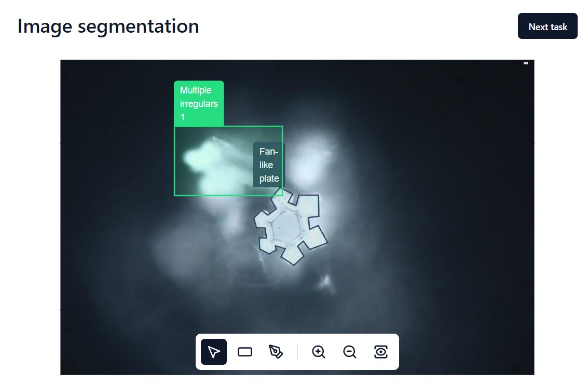
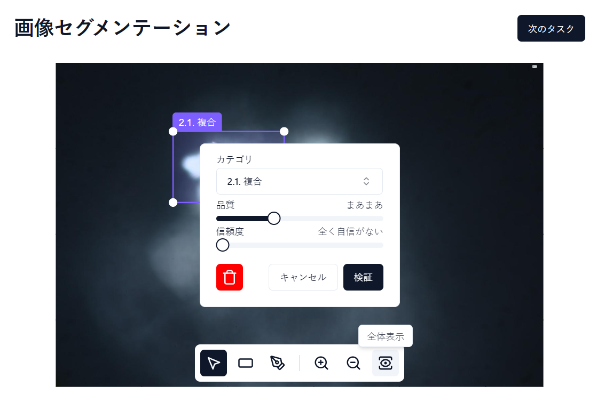
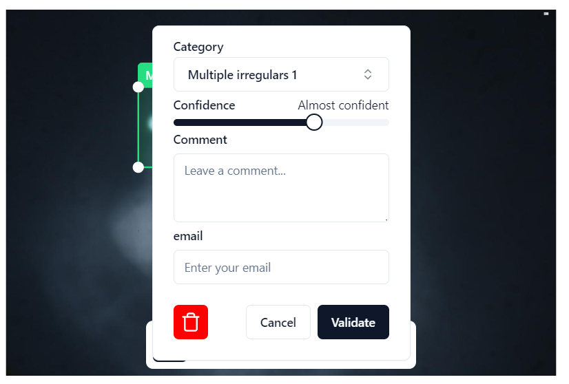
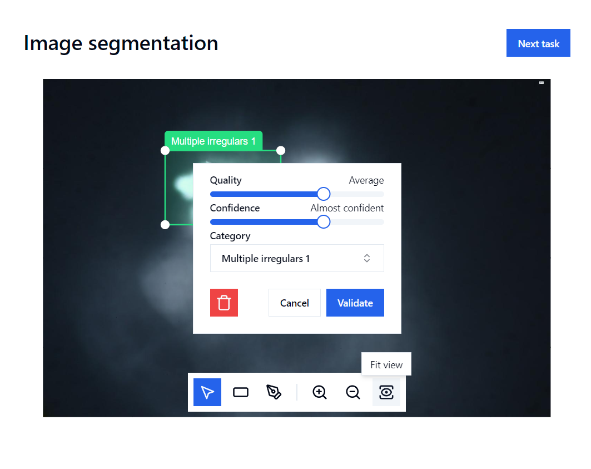

# Image segmentation

Configurable tool for segmenting images.



## Features

- Support Deep Zoom Image
- Annotation with rectangle and polygone (other SVG shape can be easily added)
- Configurable annotation (categories, text, slider, etc)
- Support multiple localisation (English, French and Japanese)
- Example with SQL database (`docs/json-path`)
- Customizable style (theme, label, etc)
- Customizable popup
- Customizable categories

## Installation

After cloning the repository and installing Node.js, run the following commands:

```bash
npm install
npm start
```

## Personalisation

### Localisation

To add a new localisation, create a new file in `src/messages` by copying an existing one and changing the values.
Then, import the file in `src/lib/i18n.ts` and add it to the `resources` object.

The locale is determined using the following order:
1. The `lang` query parameter
2. The `data-lang` attribute of the div with the `id="root"` in the `public/index.html` file
3. The browser language



### Popup

You can customize the popup form by modifying the `src/lib/settings.ts` file. Four types of fields are available: `select`, `slider`, `textarea` and `input`. If the fields must be translatable, add the key to the `src/messages` files.

For the `select` input, you can use the `useParentAsGroup` option to group the options by the parent value (the parent won't be selectable).



Example:

```typescript
export const settings: Settings = {
  // ...
  popup: {
    enabled: true,
    fields: [
      {
        id: "category",
        type: "select",
        label: "category",
        isTranslatable: true,
        useParentAsGroup: true,
        required: true,
        options: [
          {
            value: "single",
            label: "Single",
            children: [
              {
                label: "Microparticule",
                value: "microparticule",
              },
              {
                label: "Simple plate",
                value: "simple_plate",
              },
            ],
          },
          {
            value: "multiple",
            label: "Multiple",
            children: [
              {
                label: "Combinations",
                value: "combinations",
              },
              {
                label: "Double plate",
                value: "double_plate",
              },
            ],
          },
        ],
      },
      {
        id: "confidence",
        type: "slider",
        label: "confidence",
        isTranslatable: true,
        min: 0,
        max: 3,
        defaultValue: 2,
        step: 1,
        stepLabels: [
          "not_at_all_confident",
          "not_too_confident",
          "almost_confident",
          "100_percent_confident",
        ],
      },
      {
        id: "comment",
        type: "textarea",
        label: "Comment",
        isTranslatable: false,
        placeholder: "Leave a comment...",
      },
      {
        id: "email",
        type: "input",
        label: "email",
        isTranslatable: true,
        fieldType: "email",
        placeholder: "email_placeholder",
      },
    ],
  },
};
```

### Categories

To add a new category, modify the `src/lib/settings.ts` file by adding a new object to the `categories` array. You can change the outer and inner colors of the category.

```typescript
export const settings: Settings = {
  category: {
    isTranslatable: true,
    categories: [
      {
        label: "multiple_simple_plates",
        value: "multiple_simple_plates",
        outerColor: "#26de81",
        innerColor: "#26de8122",
      },
      {
        label: "multiple_plates_with_branches",
        value: "multiple_plates_with_branches",
        outerColor: "#4b7bec",
        innerColor: "#4b7bec22",
      }
    ],
  },
};
```

### Style



- To change the theme of the application, we can modify the `src/styles/index.css` file with the content provided by [shadcn/ui theme](https://ui.shadcn.com/themes).
- To change the style of the labels, modify the `src/styles/image-segmentation.css` files.

## Libraries

- [React](https://react.dev/)
- [OpenSeadragon](https://openseadragon.github.io/)
- [Annotorious](https://annotorious.github.io/)
- [shadcn/ui](https://ui.shadcn.com/)

## Tracking issues

- [Annotorious v3](https://github.com/annotorious/annotorious): support of TypeScript and fix the support of fullscreen

## Author

Made by [Mathis Boultoureau](https://github.com/mboultoureau/)
