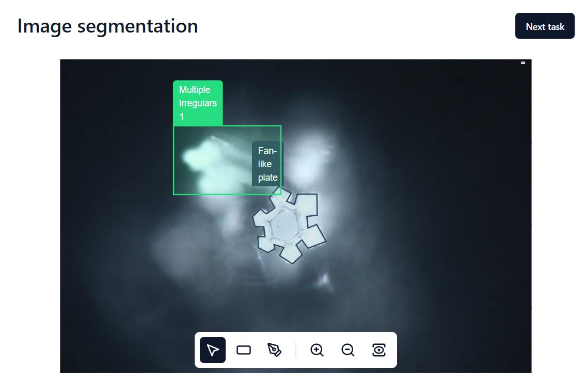

# Image segmentation

Configurable tool for segmenting images.



Exported and adaptated from Crowd Label Gen.

## Features

- Support Deep Zoom Image
- Annotation with rectangle and polygone (other SVG shape can be easily added)
- Configurable annotation (categories, text, slider, etc)
- Support all transforms
- Task is readed from API (`/api/task.json`). Two examples are provided, rename the file to `task.json` to be effective.
- Task can be sended via API. For the moment, the json is displayed when you clicked on *Next task button*.

## Installation

The code is already compiled. Depending on your system, it may block the reading of external files (JavaScript, CSS, images), in which case you must launch or host it on a server.

```bash
python3 -m http.server
```

## Issues

- [ ] Fullscreen doesn't work without SSR (so fullscreen is disabled for the moment).
- [ ] Annotorious doesn't support TypeScript in v2. Waiting for v3.